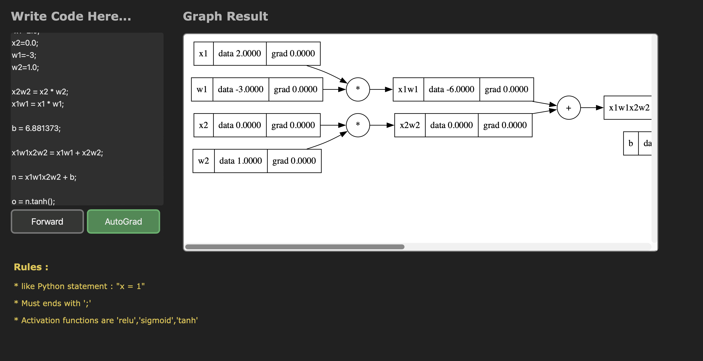
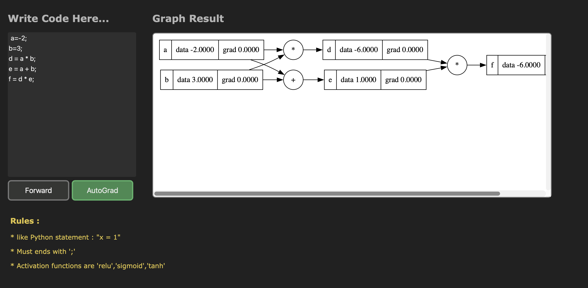
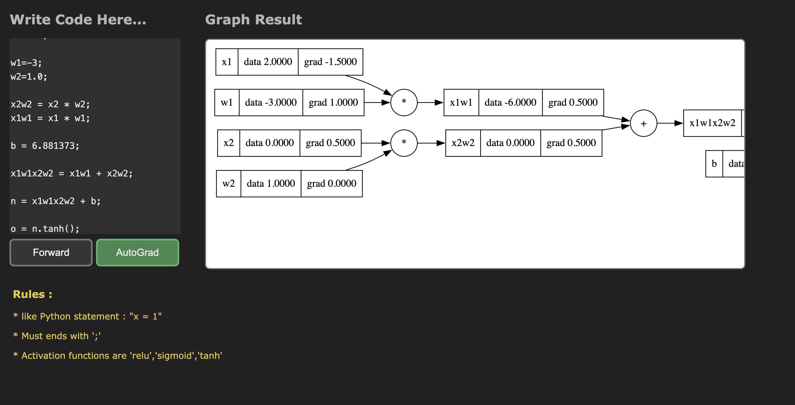

# MicroGrad with Javascript
following the MicroGrad By [Karpathy](https://github.com/karpathy/micrograd)

to build :
- [x] MicroGrad Library
- [x] Website to show the Arithmetic **Graph** and **Gradient** realtime

Video Tutorial : 

https://github.com/Shubbair/MicroGrad-JS/assets/45163499/70ec4c84-d384-4dd6-8b72-4af04bfe26a1

using :
- Pure Javascript
- Viz.js library to show graph

 

More Example : 

|  |     |        |
| ---    | ---   | ---     |
|  |  | |

# License : 
MIT
